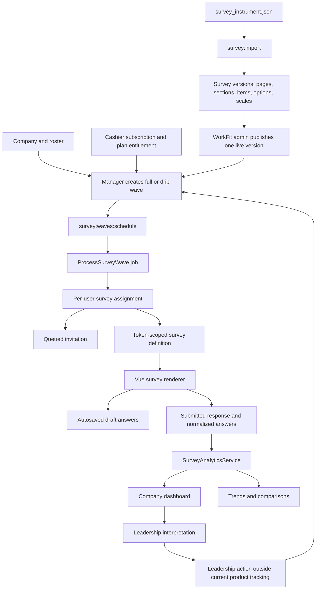

# Empulse Architecture and Current-State Guide

Status: Current source architecture
Last updated: July 27, 2026

Read [`PRODUCT_VISION_AND_BUSINESS_MODEL.md`](PRODUCT_VISION_AND_BUSINESS_MODEL.md) first. This guide explains how the current repository implements that product direction.

## System summary

Empulse is a multi-tenant Laravel 11 application with Vue 3 components mounted into Blade pages. It manages company rosters, versioned WorkFit survey content, survey-wave scheduling and invitations, response capture, organizational analytics, reports, onboarding operations, and Stripe subscriptions.

The application has two operating layers:

1. **Customer company layer** — managers, chiefs, team leads, and employees operate within one company.
2. **WorkFit platform layer** — WorkFit admins publish the shared survey instrument, inspect companies, and monitor onboarding and activation.

## Technology

| Layer | Current implementation |
| --- | --- |
| Backend | PHP 8.2+, Laravel 11 |
| Server-rendered UI | Blade and Bootstrap 5 |
| Interactive UI | Vue 3 components mounted as page-level islands |
| Asset build | Vite 5 |
| Primary production database | PostgreSQL-compatible Laravel schema |
| Local/test database | SQLite is used by the automated test configuration |
| Billing | Stripe through Laravel Cashier |
| Background work | Laravel queue jobs |
| Scheduling | Laravel scheduler and `survey:waves:schedule` |
| Charts | Chart.js / vue-chartjs plus lightweight custom components |
| Roster import/export | Maatwebsite Excel |
| Authentication | Laravel auth, Socialite, and role middleware |

See [`composer.json`](../composer.json) and [`package.json`](../package.json) for the exact dependency set.

## Actors and access

Role integers are current schema truth:

| Role | Value | Primary surfaces |
| --- | ---: | --- |
| WorkFit admin | `is_admin = 1`, commonly role `0` | `/admin`, `/admin/builder`, cross-company reports and onboarding operations |
| Manager | `1` | Analytics, team management, surveys, waves, plans, and billing |
| Chief | `2` | Company analytics and organization views |
| Team lead | `3` | Company/team views |
| Employee | `4` | `/employee` and assigned survey links |

The `admin` middleware name is historical: it allows every authenticated role except employees. The `manager` and `workfit_admin` middleware provide narrower access. New authorization work should use explicit capabilities or policies rather than inferring product meaning from a middleware name.

Tenant scope is company-based. Non-WorkFit users must not read or mutate another company's roster, waves, assignments, responses, analytics, or reports.

## Core product flow



## Major subsystems

### 1. Company and roster

Primary files:

- [`app/Models/Companies.php`](../app/Models/Companies.php)
- [`app/Models/CompanyWorker.php`](../app/Models/CompanyWorker.php)
- [`app/Http/Controllers/TeamController.php`](../app/Http/Controllers/TeamController.php)
- [`app/Services/UserService.php`](../app/Services/UserService.php)
- [`resources/js/components/team`](../resources/js/components/team)

Registration creates a company, a manager user, a manager roster row, and default departments. The `users` table provides authentication and company membership. The `company_worker` table remains the operational roster source for department, supervisor, and role metadata used by filters and wave audiences.

Managers can add or import members and maintain departments. Chiefs and team leads model the reporting hierarchy; employees are the primary respondents.

### 2. Survey content and methodology

Primary files:

- [`survey_instrument.json`](../survey_instrument.json)
- [`app/Console/Commands/ImportSurvey.php`](../app/Console/Commands/ImportSurvey.php)
- [`app/Models/SurveyVersion.php`](../app/Models/SurveyVersion.php)
- [`app/Models/SurveyPage.php`](../app/Models/SurveyPage.php)
- [`app/Models/SurveySection.php`](../app/Models/SurveySection.php)
- [`app/Models/SurveyItem.php`](../app/Models/SurveyItem.php)
- [`app/Services/SurveyDefinitionService.php`](../app/Services/SurveyDefinitionService.php)
- [`app/Http/Controllers/SurveyBuilderController.php`](../app/Http/Controllers/SurveyBuilderController.php)

The normalized content hierarchy is:

```text
SurveyVersion
├── SurveyScalePreset
└── SurveyPage
    ├── SurveyItem
    │   ├── SurveyOption
    │   └── SurveyOptionSource
    └── SurveySection
        └── SurveyItem
            ├── SurveyOption
            └── SurveyOptionSource
```

`php artisan survey:import {path} [--activate]` imports the JSON instrument transactionally. It preserves stable question IDs, scale presets, response configuration, display logic, option metadata, generated option sources, and analytics hints.

One `SurveyVersion` is active globally. WorkFit admin owns publication through `/admin/builder`. Managers can inspect survey availability and operate waves, but they do not currently publish content.

`SurveyDefinitionService` turns the active version into the token-scoped JSON consumed by the survey renderer. It resolves scale presets and generated options and exposes deterministic question-count and time-estimate metadata.

### 3. Survey waves, assignments, and invitations

Primary files:

- [`app/Models/SurveyWave.php`](../app/Models/SurveyWave.php)
- [`app/Models/SurveyAssignment.php`](../app/Models/SurveyAssignment.php)
- [`app/Http/Controllers/SurveyWaveController.php`](../app/Http/Controllers/SurveyWaveController.php)
- [`app/Console/Commands/ScheduleSurveyWaves.php`](../app/Console/Commands/ScheduleSurveyWaves.php)
- [`app/Jobs/ProcessSurveyWave.php`](../app/Jobs/ProcessSurveyWave.php)
- [`app/Jobs/SendSurveyAssignmentInvitation.php`](../app/Jobs/SendSurveyAssignmentInvitation.php)
- [`app/Support/SurveyWaveAutomation.php`](../app/Support/SurveyWaveAutomation.php)

A wave belongs to a company, survey, and survey version. It defines:

- full or drip behavior;
- manual, weekly, monthly, or quarterly cadence;
- target roles;
- open and due dates;
- status and last-dispatch state.

The scheduler finds eligible waves. `ProcessSurveyWave` creates or refreshes per-user assignments, applies cadence rules, queues invitations, records dispatch state, and updates the wave. `survey_wave_logs` provides an operational history.

Full waves are the baseline path and use manual cadence. Drip waves are the recurring path and are plan-gated.

### 4. Survey-taking and response persistence

Primary files:

- [`app/Http/Controllers/SurveyController.php`](../app/Http/Controllers/SurveyController.php)
- [`app/Services/SurveyService.php`](../app/Services/SurveyService.php)
- [`app/Services/SurveyResponseValidationService.php`](../app/Services/SurveyResponseValidationService.php)
- [`resources/js/components/survey/SurveyApp.vue`](../resources/js/components/survey/SurveyApp.vue)
- [`resources/js/components/survey/SurveyItem.vue`](../resources/js/components/survey/SurveyItem.vue)

Every assignment has a random token and is associated with a specific user, version, and optionally a wave. Token routes expose the survey, definition, autosave, and submit endpoints.

The Vue renderer supports pagination, progress, sliders, text, number, select, multi-select, conditional display, client-side validation, autosave, and resume. Submission stores:

```text
SurveyAssignment
└── SurveyResponse
    └── SurveyAnswer
```

Answers retain the stable `question_key`, normalized numeric value when applicable, and item metadata needed by analytics.

The current data model is identifiable: assignments and responses reference a user. This is a product and architecture invariant until a deliberate anonymity design replaces it.

The current source does not establish a complete policy for individual-answer visibility, retention, confidentiality, or minimum cohort suppression. Those are product, privacy, and authorization decisions still to be designed; token security alone does not answer them.

### 5. Analytics and reports

Primary files:

- [`app/Services/SurveyAnalyticsService.php`](../app/Services/SurveyAnalyticsService.php)
- [`config/survey.php`](../config/survey.php)
- [`app/Http/Controllers/AnalyticsApiController.php`](../app/Http/Controllers/AnalyticsApiController.php)
- [`app/Http/Controllers/ReportsApiController.php`](../app/Http/Controllers/ReportsApiController.php)
- [`resources/js/components/analytics`](../resources/js/components/analytics)
- [`resources/js/components/dashboard`](../resources/js/components/dashboard)
- [`resources/js/components/reports`](../resources/js/components/reports)

Dashboard analytics select the latest completed response per employee within a company and optional wave, then apply department and team filters. Only analytics-relevant numeric answers are loaded.

High-level calculations:

- work-content gap = `ideal - current`;
- indicator satisfaction normalizes current against ideal on a 0–10 scale;
- weighted indicator = configured weighted average of indicator satisfaction;
- negative culture items are reverse-scored;
- team-culture evaluation is a weighted average of:
  - Team Culture Core
  - Psychological Safety
  - Ethics & Leadership
- temperature index combines normalized culture and weighted indicator scores;
- impact aggregates current/positive, importance, and desire series;
- trend reports compare completed waves;
- comparison reports group a selected wave by department or team.

`config/survey.php` is the source of truth for question membership, polarity, labels, and weights. Formula changes require tests in `SurveyAnalyticsServiceTest` and representative feature coverage.

Configuration and passing tests prove consistent implementation, not scientific validity. Approved methodology evidence, interpretation thresholds, and benchmark provenance must live in a separate reviewed evidence package before product copy or dashboards make those claims.

### 6. Billing and entitlements

Primary files:

- [`app/Http/Controllers/PlanController.php`](../app/Http/Controllers/PlanController.php)
- [`app/Http/Controllers/BillingController.php`](../app/Http/Controllers/BillingController.php)
- [`app/Http/Controllers/StripeWebhookController.php`](../app/Http/Controllers/StripeWebhookController.php)
- [`app/Support/CompanyBilling.php`](../app/Support/CompanyBilling.php)
- [`app/Support/SurveyWaveAutomation.php`](../app/Support/SurveyWaveAutomation.php)
- [`config/billing.php`](../config/billing.php)
- [`config/survey.php`](../config/survey.php)

Cashier subscriptions belong to the manager user. The webhook is the subscription-state source of truth and propagates the compatibility `tariff` to users in the company.

Survey scheduling requires an allowed billing state. Drip automation additionally requires a tariff configured in `survey.automation.drip_tariffs`; the current premium tariff is `1`.

Product packaging is not fully normalized in code. Plan rows, Stripe prices, marketing metadata, and integer tariffs all participate. Consult the business-model document before adding another entitlement.

The company is the intended durable customer account, but subscription transfer and multiple billing-administrator behavior do not yet exist as an explicit domain model.

### 7. WorkFit administration and activation operations

Primary files:

- [`app/Http/Controllers/WorkfitAdminController.php`](../app/Http/Controllers/WorkfitAdminController.php)
- [`app/Services/OnboardingReportService.php`](../app/Services/OnboardingReportService.php)
- [`app/Services/OnboardingTelemetryService.php`](../app/Services/OnboardingTelemetryService.php)
- [`resources/js/components/admin`](../resources/js/components/admin)

WorkFit admin can inspect companies and subscriptions, impersonate users for support, publish survey content, and review onboarding health.

First-party `onboarding_events` record activation behaviors and durable milestones. The operational stages are:

- Dormant
- Started
- Wave Sent
- Live Data

The onboarding report turns those events into company cohorts and intervention alerts. This is an internal customer-success and activation tool, not the product analytics source for employee results.

## Frontend composition

Empulse is not a single-page application. Blade owns routing, layout, server-provided context, and legacy pages. Vue components mount conditionally for richer product areas:

- analytics;
- reports;
- team management;
- survey builder;
- survey-taking;
- selected dashboard visualizations;
- WorkFit admin.

`resources/js/app.js` is the mount coordinator. New Vue work should preserve conditional mounting and should not assume every route provides every root element.

Generated Vite assets belong in `public/build` at deployment time. Source changes belong in `resources`.

## Runtime processes

A complete production runtime requires:

1. web process;
2. queue worker;
3. scheduler.

Without the worker, survey invitations and wave jobs stall. Without the scheduler, recurring waves do not become jobs.

Operational commands:

```bash
php artisan queue:work --tries=1
php artisan schedule:run
php artisan survey:waves:schedule
```

The scheduler should normally invoke the wave command through [`routes/console.php`](../routes/console.php), not through a second external cadence.

See [`PRODUCTION_DEPLOYMENT_RUNBOOK.md`](PRODUCTION_DEPLOYMENT_RUNBOOK.md) for environment, migration, worker, rollback, and release checks.

## Data ownership and truth boundaries

| Concern | Source of truth |
| --- | --- |
| Product intent and commercial direction | `docs/PRODUCT_VISION_AND_BUSINESS_MODEL.md` |
| Company identity | `companies` |
| Authenticated users and company membership | `users` |
| Organizational roster metadata | `company_worker` and `company_department` |
| Survey content | active normalized `survey_versions` hierarchy |
| Instrument source file | `survey_instrument.json` |
| Assignment and dispatch state | `survey_waves`, `survey_assignments`, `survey_wave_logs` |
| Submitted employee data | `survey_responses` and `survey_answers` |
| Methodology mappings | `config/survey.php` |
| Subscription status | Cashier `subscriptions`, synchronized by Stripe webhook |
| Compatibility entitlement | user `tariff`, derived from subscription state |
| Onboarding operations | `onboarding_events` and `OnboardingReportService` |
| Deployment process | `docs/PRODUCTION_DEPLOYMENT_RUNBOOK.md` |

## Product invariants for developers

1. Never cross company boundaries unless the authenticated actor is explicitly authorized as WorkFit admin.
2. Do not change question IDs after data collection; analytics depends on stable keys.
3. Do not change formula mappings or polarity silently.
4. Do not present local, seeded, or demo data as a production customer result.
5. Do not promise anonymous responses while responses remain user-linked.
6. Do not dispatch a wave without company context, a live version, an eligible billing state, and a valid audience.
7. Preserve separate full-wave and recurring-drip semantics.
8. Keep billing webhooks, not return URLs, as subscription truth.
9. Keep queue and scheduler requirements visible in operational handoffs.
10. Treat first completed response as workflow activation, not as a reliable company diagnosis. A defined minimum sample must precede confident cohort interpretation.
11. Treat leadership action and later movement as customer value, while recognizing that action recommendation and tracking are not implemented subsystems today.

## Transitional seams

These are current-state constraints future work should understand:

- role and plan semantics still use integer fields;
- billing meaning is distributed across plans, Cashier subscriptions, marketing config, and `tariff`;
- roster metadata is split between `users` and `company_worker`;
- the repository contains older Blade/controllers alongside newer Vue/service flows;
- both legacy and normalized survey model classes remain, but the normalized version hierarchy powers the current instrument;
- the shared instrument is global rather than company-specific.

Do not remove a seam merely because it looks old. First identify its current routes, data dependencies, tests, and migration path.

## Where to make common changes

| Change | Start here |
| --- | --- |
| Product positioning or packaging | `docs/PRODUCT_VISION_AND_BUSINESS_MODEL.md`, then billing config and customer copy |
| Survey question or scale | `survey_instrument.json`, importer, version publication, validation tests |
| Analytics formula | `config/survey.php`, `SurveyAnalyticsService`, unit/feature tests |
| Manager dashboard | `AnalyticsApiController`, `AnalyticsDashboard.vue`, dashboard components |
| Trend or cohort report | `ReportsApiController`, analytics service, reports components |
| Wave behavior | `SurveyWaveController`, scheduler command, `ProcessSurveyWave`, wave tests |
| Billing entitlement | Cashier webhook, `CompanyBilling`, `SurveyWaveAutomation`, billing tests |
| Roster or hierarchy | `TeamController`, `UserService`, team Vue components, tenant tests |
| Survey experience | `SurveyDefinitionService`, `SurveyController`, survey Vue components, validation tests |
| WorkFit operations | `OnboardingReportService`, WorkFit admin components, admin feature tests |

## Verification

Primary quality gates:

```bash
php artisan test
npm run lint
npm run build
npm run test:e2e
```

For analytics query changes, also use:

```bash
php artisan analytics:explain {company_id} [--wave=...] [--no-analyze]
```

Follow [`ANALYTICS_EXPLAIN_CHECKLIST.md`](ANALYTICS_EXPLAIN_CHECKLIST.md) before treating a production-scale analytics change as ready.
