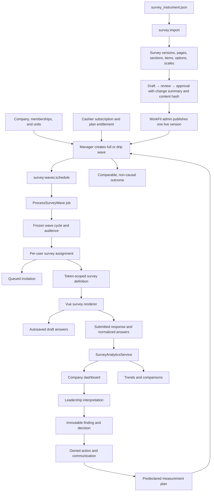

# Empulse Architecture and Current-State Guide

Status: Current source architecture
Last updated: July 27, 2026

Read [`PRODUCT_VISION_AND_BUSINESS_MODEL.md`](PRODUCT_VISION_AND_BUSINESS_MODEL.md) first. This guide explains how the current repository implements that product direction.

## System summary

Empulse is a multi-tenant Laravel 12 application with Vue 3 components mounted into Blade pages. It manages company rosters, versioned WorkFit survey content, survey-wave scheduling and invitations, response capture, organizational analytics, reports, onboarding operations, and Stripe subscriptions.

The application has two operating layers:

1. **Customer company layer** — managers, chiefs, team leads, and employees operate within one company.
2. **WorkFit platform layer** — WorkFit admins publish the shared survey instrument, inspect companies, and monitor onboarding and activation.

## Technology

| Layer | Current implementation |
| --- | --- |
| Backend | PHP 8.2+, Laravel 12 |
| Server-rendered UI | Blade and Bootstrap 5 |
| Interactive UI | Vue 3 components mounted as page-level islands |
| Asset build | Vite 8 on Node 22+ |
| Primary production database | PostgreSQL-compatible Laravel schema |
| Local/test database | SQLite is used by the automated test configuration |
| Billing | Stripe through Laravel Cashier |
| Background work | Laravel queue jobs |
| Scheduling | Laravel scheduler and `survey:waves:schedule` |
| Charts | Chart.js / vue-chartjs plus lightweight custom components |
| Roster provisioning | Manual or governed CSV preview/reconciliation, followed by invitation-backed account setup |
| Authentication | Laravel auth, Socialite, explicit capabilities, and row-scoped policies |

See [`composer.json`](../composer.json) and [`package.json`](../package.json) for the exact dependency set.

## Actors and access

Role integers are current schema truth:

| Role | Value | Primary surfaces |
| --- | ---: | --- |
| WorkFit admin | `is_admin = 1`, commonly role `0` | `/admin`, `/admin/builder`, cross-company reports and onboarding operations |
| Manager | `1` | Analytics, team management, surveys, waves, plans, and billing |
| Chief | `2` | Company analytics and organization views |
| Team lead | `3` | Company/team views |
| Employee | `4` | `/employee` and assigned survey links |

`config/capabilities.php` is the named capability map. `organization_memberships` supplies the current organization-scoped role when present, and `OrganizationScopeService` resolves chief/team-lead row scope from ID-based units and reporting relationships. The former broad role middleware and platform-admin policy bypasses are removed.

Tenant scope is company-based. Non-WorkFit users must not read or mutate another company's roster, waves, assignments, responses, analytics, or reports.

## Core product flow



## Major subsystems

### 1. Company and roster

Primary files:

- [`app/Models/Companies.php`](../app/Models/Companies.php)
- [`app/Models/CompanyWorker.php`](../app/Models/CompanyWorker.php)
- [`app/Models/OrganizationMembership.php`](../app/Models/OrganizationMembership.php)
- [`app/Models/OrganizationUnit.php`](../app/Models/OrganizationUnit.php)
- [`app/Models/OrganizationAssignment.php`](../app/Models/OrganizationAssignment.php)
- [`app/Http/Controllers/TeamController.php`](../app/Http/Controllers/TeamController.php)
- [`app/Http/Controllers/RosterImportController.php`](../app/Http/Controllers/RosterImportController.php)
- [`app/Services/UserService.php`](../app/Services/UserService.php)
- [`app/Services/RosterImportService.php`](../app/Services/RosterImportService.php)
- [`app/Models/RosterImport.php`](../app/Models/RosterImport.php)
- [`app/Models/RosterExternalIdentity.php`](../app/Models/RosterExternalIdentity.php)
- [`resources/js/components/team`](../resources/js/components/team)

Registration transactionally creates a company, owner identity, roster projection, effective-dated membership, and explicit unresolved unit assignment. Password registration requires at least 12 characters. Social identities are unique; a provider login cannot silently attach itself to an existing email account.

`organization_memberships`, `organization_units`, and `organization_assignments` are canonical organization history. Membership role/status and unit/reporting changes close the previous effective-dated record and append a new one. `company_worker` and `company_department` remain compatibility projections for the existing team-management UI; they do not own historical analytics truth.

Managers can add members individually or use the governed CSV importer. Import source is encrypted while queued and discarded after parsing. `roster_external_identities` provides stable company-scoped identity matching. Every row is classified as create, update, reactivate, deactivate, unchanged, or invalid before mutation; unknown departments, unresolved or ineligible supervisors, duplicate identities, and cross-company email reuse fail closed. Deactivation must be explicit—absence from a file has no effect—and manager deactivation stays in the billing/owner-transfer workflow.

An error-free preview receives a short-lived one-time confirmation token. Commit locks the preview, verifies that target fingerprints, departments, supervisors, and emails have not changed, and applies all compatibility and effective-dated organization changes in one transaction. New and reactivated identities receive account-only invitations through the queue using a stable provider idempotency key. Parse jobs are unique for a bounded 15-minute recovery window; `roster:imports:recover` reports or requeues only stale encrypted parsing work, and an identical re-upload can rehydrate an unexpectedly failed import without creating a second import record. Queue submission cannot roll back an already committed roster; the scheduled `account:invitations:recover --execute` command finds eligible pending, failed, or interrupted deliveries and safely requeues them.

Preview and commit events enter the tamper-evident company audit stream; sanitized row results are downloadable as CSV. Detailed import rows and staged source expire after 30 days through the same hash-confirmed, legal-hold-aware retention workflow used for other privacy data. The durable import summary and audit evidence remain, but purged previews cannot be confirmed or downloaded.

Chiefs and team leads model the reporting hierarchy; employees are the primary respondents.

### 2. Survey content and methodology

Primary files:

- [`survey_instrument.json`](../survey_instrument.json)
- [`app/Console/Commands/ImportSurvey.php`](../app/Console/Commands/ImportSurvey.php)
- [`app/Models/SurveyVersion.php`](../app/Models/SurveyVersion.php)
- [`app/Models/SurveyPage.php`](../app/Models/SurveyPage.php)
- [`app/Models/SurveySection.php`](../app/Models/SurveySection.php)
- [`app/Models/SurveyItem.php`](../app/Models/SurveyItem.php)
- [`app/Services/SurveyDefinitionService.php`](../app/Services/SurveyDefinitionService.php)
- [`app/Http/Controllers/SurveyBuilderController.php`](../app/Http/Controllers/SurveyBuilderController.php)

The normalized content hierarchy is:

```text
SurveyVersion
├── SurveyScalePreset
└── SurveyPage
    ├── SurveyItem
    │   ├── SurveyOption
    │   └── SurveyOptionSource
    └── SurveySection
        └── SurveyItem
            ├── SurveyOption
            └── SurveyOptionSource
```

`php artisan survey:import {path}` imports the JSON instrument transactionally as a draft. It preserves stable question IDs, scale presets, response configuration, display logic, option metadata, generated option sources, and analytics hints. Governed command-line publication additionally requires `--activate`, `--approved-by=<active WorkFit admin ID>`, and a change summary of at least ten characters.

One `SurveyVersion` is active globally. WorkFit admin owns publication through `/admin/builder`. A version moves through `draft → in_review → approved → published`; the previous live version becomes `retired`. Submission for review runs structural and metric-compatibility lint, records a human-readable change summary and exact semantic content hash, and locks content editing. Approval and publication recheck that hash. Reviewer, approver, publisher, timestamps, and platform audit events are durable. Direct publication of an unapproved draft fails closed. Managers can inspect survey availability and operate waves, but they do not publish content.

`SurveyDefinitionService` turns the active version into the token-scoped JSON consumed by the survey renderer. It resolves scale presets and generated options and exposes deterministic question-count and time-estimate metadata.

### 3. Survey waves, assignments, and invitations

Primary files:

- [`app/Models/SurveyWave.php`](../app/Models/SurveyWave.php)
- [`app/Models/SurveyAssignment.php`](../app/Models/SurveyAssignment.php)
- [`app/Models/SurveyWaveCycle.php`](../app/Models/SurveyWaveCycle.php)
- [`app/Models/SurveyWaveAudienceMember.php`](../app/Models/SurveyWaveAudienceMember.php)
- [`app/Http/Controllers/SurveyWaveController.php`](../app/Http/Controllers/SurveyWaveController.php)
- [`app/Console/Commands/ScheduleSurveyWaves.php`](../app/Console/Commands/ScheduleSurveyWaves.php)
- [`app/Jobs/ProcessSurveyWave.php`](../app/Jobs/ProcessSurveyWave.php)
- [`app/Jobs/SendSurveyAssignmentInvitation.php`](../app/Jobs/SendSurveyAssignmentInvitation.php)
- [`app/Support/SurveyWaveAutomation.php`](../app/Support/SurveyWaveAutomation.php)

A wave belongs to a company, survey, and survey version. It defines:

- full or drip behavior;
- manual, weekly, monthly, or quarterly cadence;
- target roles;
- open and due dates;
- status and last-dispatch state.

The scheduler finds eligible waves. Before assignment creation, `SurveyCohortService` creates an immutable wave occurrence, freezes its eligible audience, and stores audience, instrument, and metric-definition hashes. Each frozen audience member captures organization membership, unit, reporting relationship, role, and unresolved-state truth. `ProcessSurveyWave` creates assignments against that occurrence, applies cadence rules, queues invitations, records dispatch state, and updates the wave. A successful first dispatch moves both full and one-time manual Pulse waves to `active`; queue completion is not collection completion. The wave becomes `completed` only when all frozen assignments complete or its due date passes. Active one-time waves are not redispatched. `survey_wave_logs` provides an eager-loaded operational delivery history that remains renderable after dispatch.

Invitation and reminder attempts use deterministic application keys plus stable UUID provider-idempotency keys. A first attempt rotates the assignment access token once and stores the survey URL encrypted inside the append-only attempt record; automatic retries reuse that exact URL and provider key. Brevo currently retains email idempotency keys for 30 minutes, so Empulse stops automatic retries at 25 minutes and requires provider-activity review before any later resend. `email_delivery_events` distinguishes queued, provider-accepted, delivered, bounced, complained, unsubscribed, and failed states; the manager funnel does not label provider acceptance as delivery. Authenticated Brevo webhooks update the funnel. `delivery_contacts` suppress bounced, complaining, and unsubscribed addresses from future mail, while reminder jobs refuse completed, expired, revoked, or closed-wave assignments.

Full waves are the baseline path and use manual cadence. Drip waves are the recurring path and are plan-gated.

### 4. Survey-taking and response persistence

Primary files:

- [`app/Http/Controllers/SurveyController.php`](../app/Http/Controllers/SurveyController.php)
- [`app/Services/SurveyService.php`](../app/Services/SurveyService.php)
- [`app/Services/SurveyResponseValidationService.php`](../app/Services/SurveyResponseValidationService.php)
- [`resources/js/components/survey/SurveyApp.vue`](../resources/js/components/survey/SurveyApp.vue)
- [`resources/js/components/survey/SurveyItem.vue`](../resources/js/components/survey/SurveyItem.vue)

Every assignment is pinned to a user and survey version and, for scheduled measurement, a wave occurrence and frozen audience member. Access tokens are high-entropy, stored only as SHA-256 hashes, expiring, revocable, and rotated immediately before launch or delivery. Token routes are rate-limited and reject expired, revoked, completed, inactive-user, unpinned, future, paused, and closed-wave access.

The Vue renderer supports pagination, progress, sliders, text, number, select, multi-select, conditional display, client-side validation, autosave, and resume. Submission stores:

```text
SurveyAssignment
└── SurveyResponse
    └── SurveyAnswer
```

`SurveyDraftService` owns the revisioned autosave compare-and-swap so HTTP requests and the concurrency rehearsal use the same atomic write. Stale-tab overwrites are rejected without replacing the winning payload. Final submission row-locks the assignment and atomically creates one response plus unique answers before completing the assignment and revoking access. Answers retain the stable `question_key`, normalized numeric value when applicable, and item metadata needed by analytics.

The collection model is identifiable: assignments and responses reference a user. Respondents acknowledge the versioned promise in `docs/RESPONDENT_DATA_PROMISE.md` before submission. Customer-facing analytics never expose individual answers. `PrivacyGovernanceService` implements verified access, correction, erasure/pseudonymization, and legal-hold workflows; `RetentionService` requires a reviewed dry-run hash before execution. Every consequential privacy transition is audit chained.

### 5. Analytics and reports

Primary files:

- [`app/Services/SurveyAnalyticsService.php`](../app/Services/SurveyAnalyticsService.php)
- [`config/survey.php`](../config/survey.php)
- [`app/Http/Controllers/AnalyticsApiController.php`](../app/Http/Controllers/AnalyticsApiController.php)
- [`app/Http/Controllers/ReportsApiController.php`](../app/Http/Controllers/ReportsApiController.php)
- [`resources/js/components/analytics`](../resources/js/components/analytics)
- [`resources/js/components/dashboard`](../resources/js/components/dashboard)
- [`resources/js/components/reports`](../resources/js/components/reports)

Dashboard analytics select the latest completed response per employee within one exact immutable wave cycle. A recurring wave's occurrences are never pooled. Department/team filters and role scope are applied from frozen response-cohort IDs: managers receive company scope, chiefs their assigned organization unit, and team leads respondents whose frozen reporting line points to their membership. Request parameters can narrow but cannot widen that scope. Current roster text is a legacy-only fallback for pre-cycle evidence; moving, renaming, or deactivating a person cannot rewrite prior-wave grouping.

The immutable metric registry is the calculation contract for a wave and response. Historical dashboard, trend, comparison, scatter, impact, and reliability calculations resolve the registry definition pinned to the selected cycle and fail closed if its ID/hash cannot be verified; they do not reinterpret frozen responses with current configuration. Registry version labels include a deterministic content-hash suffix. The current canonical baseline has 62 purpose-bound items. High-level calculations:

- work-content gap = paired complete-case `ideal - current`; valid N is the number of respondents who supplied both values, and both means use that same population;
- indicator satisfaction normalizes current against ideal on a 0–10 scale;
- weighted indicator = configured weighted average of indicator satisfaction;
- negative culture items are reverse-scored;
- team-culture evaluation is a weighted average of:
  - Team Culture Core
  - Psychological Safety
  - Ethics & Leadership
- temperature index combines normalized culture and weighted indicator scores;
- impact aggregates current/positive, importance, and desire series;
- trend reports compare completed waves;
- comparison reports group a selected wave by department or team.

`MetricRegistryService` publishes a content-hashed version derived from governed configuration. Wave cycles and responses pin its ID and hash. Formula changes require a new registry version, publication compatibility checks, golden fixtures, and representative feature coverage.

Analytics calculate respondent-level scales before cohort aggregation, disclose valid N and missingness, default to one frozen wave, and gate values behind the release sample policy (company N≥5, subgroup N≥7, completion ≥40%). Complementary suppression protects small groups. Trends require compatible instrument and metric hashes; culture reliability is shown only when calculable. The methods and permitted claims are documented in `docs/METHODOLOGY_AND_CLAIMS_DOSSIER.md`. Passing tests prove consistent implementation, not independent scientific validation.

### 6. Findings, action, and governed learning

`ActionLoopService` turns an eligible, server-recomputed metric into an immutable finding snapshot. Only decision fields may change after capture; evidence, cohort, metric, interpretation, and limits are append-only. Leadership must record a rationale, owner, hypothesis, planned change, guardrails, success criterion, and predeclared measurement plan before commitment. Communications are attributable and audited. A follow-up can be created only from the frozen metric definition and a company entitlement that includes recurring waves.

Published `intervention_playbook_versions` are immutable. Every option carries an explicit evidence source, conservative evidence grade, applicability, limitations, guardrails, and claim limit. The catalog includes an “investigate before choosing an intervention” path for reliable findings whose mechanism remains uncertain. No playbook represents causal evidence; independent methodology/advisory approval remains a release gate.

`PulseVariantService` produces a published, immutable action-follow-up variant containing only the governed metric items. The audience is frozen per cycle; fatigue rules enforce a minimum 30-day rest and no more than three pulse invitations in 90 days, and reminders are capped per wave. Outcome evaluation requires matching instrument and metric hashes, exposes sampling limits, and always uses non-causal wording.

`ActionLoopValueReportService` exposes a stable versioned WorkFit-admin report over the immutable chain: eligible finding → accepted decision → owned action → measurement plan → measured outcome. It reports privacy-safe counts, rates, result categories, and organization summaries. It never returns answer content or employee identity, and viewing the report is itself audited.

WorkFit advisory is not a platform-wide customer-data bypass. A customer administrator must grant a named active advisor a purpose-bound, optionally expiring `advisor_company_grants` record. The customer can revoke it at any time; grants and revocations enter the tamper-evident audit stream. Action routes and services re-check the active grant for the selected company.

`AdvisorWorkQueueService` exposes activation risk, finding review, action-plan assistance, and overdue follow-up only for companies covered by the current advisor’s active grants. Queue responses contain sanitized workflow metadata, not answer content or stored context payloads. Claim, complete, and dismiss transitions are customer-scoped and audited. `advisor_workspace_notes` are append-only and explicitly split into `customer_shared` and `workfit_internal`; customer users never receive internal notes, and audit events record visibility/length rather than note bodies.

### 7. Billing and entitlements

Primary files:

- [`app/Http/Controllers/PlanController.php`](../app/Http/Controllers/PlanController.php)
- [`app/Http/Controllers/BillingController.php`](../app/Http/Controllers/BillingController.php)
- [`app/Http/Controllers/StripeWebhookController.php`](../app/Http/Controllers/StripeWebhookController.php)
- [`app/Support/CompanyBilling.php`](../app/Support/CompanyBilling.php)
- [`app/Support/SurveyWaveAutomation.php`](../app/Support/SurveyWaveAutomation.php)
- [`config/billing.php`](../config/billing.php)
- [`config/survey.php`](../config/survey.php)

Cashier's customer model is `Companies`; its legacy `subscriptions.user_id` column stores the durable company ID. `organization_billing_admins` is the sole authorization source for account management: an ordinary manager or chief role does not imply billing access. The active owner can appoint or revoke additional active billing administrators, while owner replacement uses the explicit request/acceptance transfer workflow. Every appointment, revocation, and transfer is tenant-scoped and audited, so manager departure does not orphan billing. `organization_entitlements` is the only current feature-gating authority and stores the active projection of plan, status, features, limits, source, expiry, and Stripe reconciliation state. `billing_catalog_versions` content-hashes each effective catalog/trial/access contract, while append-only `organization_entitlement_versions` preserve every company entitlement’s original catalog, feature, limit, price-reference, lifecycle, and subscription terms. Updating current configuration cannot rewrite historical commercial evidence.

Stripe webhook events are payload-hashed, idempotent, replay-safe, and stale-event guarded in `billing_webhook_events`. Survey scheduling requires an organization entitlement in an allowed state; recurring waves additionally require the `recurring_waves` feature. Expired manual grants and canceled/past-due subscriptions cannot start new dispatches. Existing collected data uses a separate access-state policy.

The canonical feature/limit catalog is `config/billing.php`; production Stripe price IDs come from environment configuration. Legacy user `tariff` remains a display/import compatibility field and is not authorization truth. Usage is appended idempotently to `organization_usage_events` and cannot alter collected evidence. The billing page exposes a privacy-safe derivation for each period—event count, summed quantity, unit, definition, and first/last event time—without member IDs or survey content.

Trial creation is disabled until the product owner approves a policy. Billing-owner transfer is request/acceptance gated and keeps the old owner as an administrator for continuity. Active-respondent limits are reserved under a company-row lock in the same transaction as assignment dispatch state, preventing concurrent workers from oversubscribing the plan; usage events remain append-only and idempotent. `billing:sync-catalog` materializes only checkout-enabled plans whose Stripe price IDs and approved integer prices are complete. Final public prices remain owner-gated.

### 8. WorkFit administration and activation operations

Primary files:

- [`app/Http/Controllers/WorkfitAdminController.php`](../app/Http/Controllers/WorkfitAdminController.php)
- [`app/Services/OnboardingReportService.php`](../app/Services/OnboardingReportService.php)
- [`app/Services/OnboardingTelemetryService.php`](../app/Services/OnboardingTelemetryService.php)
- [`resources/js/components/admin`](../resources/js/components/admin)

WorkFit admin can inspect companies and subscriptions, operate governed survey publication, review onboarding health, investigate sanitized audit metadata, and work a grant-scoped advisor queue. Direct impersonation and hard user deletion are intentionally unavailable; any future support-access feature must be time-bound, reason-coded, scoped, consent-aware, and audited.

Route and controller access uses named capabilities from `config/capabilities.php`. `RequireCapability` is the enforcement point. The current integer roles are only mapped into this capability vocabulary as a transition toward durable organization memberships; “not an employee” is not an authorization grant.

First-party `onboarding_events` record activation behaviors and durable milestones. The operational stages are:

- Dormant
- Started
- Wave Sent
- Live Data

The onboarding report turns those events into company cohorts and intervention alerts. This is an internal customer-success and activation tool, not the product analytics source for employee results.

## Frontend composition

Empulse is not a single-page application. Blade owns routing, layout, server-provided context, and legacy pages. Vue components mount conditionally for richer product areas:

- analytics;
- reports;
- team management;
- survey builder;
- survey-taking;
- selected dashboard visualizations;
- WorkFit admin.

`resources/js/app.js` is the mount coordinator. New Vue work should preserve conditional mounting and should not assume every route provides every root element.

Generated Vite assets belong in `public/build` at deployment time. Source changes belong in `resources`.

## Operational data safety

Application logs and customer-visible errors contain only generic failure language, stable record IDs, provider request IDs when safe, and exception class names. They do not retain provider response bodies, recipient/message content, SQL text, credentials, or stack traces. Login throttling fails closed through Laravel’s rate limiter; no database-backed login-debug cache exists.

Profile avatars are untrusted uploads. The server validates image type, size, and dimensions, decodes and normalizes the image, writes a generated JPEG through the configured `AVATAR_DISK`, then updates the user record and removes the prior object. Production must provide a persistent/shared storage disk; the local public disk is not durable across ephemeral releases.

## Runtime processes

A complete production runtime requires:

1. web process;
2. queue worker;
3. scheduler.

Without the worker, roster parsing, survey/account invitations, and wave jobs stall. Without the scheduler, recurring waves do not become jobs and interrupted roster parsing or account/survey invitation deliveries are not recovered.

Operational commands:

```bash
php artisan queue:work --tries=3 --backoff=10 --timeout=120
php artisan schedule:run
php artisan survey:waves:schedule
php artisan roster:imports:recover
php artisan account:invitations:recover
php artisan survey:invitations:recover
```

The scheduler should normally invoke wave scheduling and all three recovery commands through [`routes/console.php`](../routes/console.php), not through a second external cadence. A frozen assignment is marked dispatched and counted under the organization entitlement once; replaying the same wave job does not increment its dispatch count or queue another invitation. Survey invitation delivery jobs are unique per assignment for the 15-minute recovery interval. The scheduled recovery commands find stale eligible work, remain report-only without `--execute`, and reuse the relevant uniqueness or delivery-idempotency contract.

PostgreSQL is the production database authority. The image build does not run migrations. A release process binds the artifact to an exact `APP_RELEASE_SHA` and stable `DEPLOYMENT_ENVIRONMENT_ID`, runs `app:production-check`, applies migrations once, then starts independently supervised web, worker, and scheduler processes. Production configuration cannot disable process-heartbeat readiness or use an unbounded heartbeat age. `/api/healthz` is process liveness; `/api/readyz` checks database, required runtime tables, and production process freshness without exposing credentials or exception detail. Both surfaces and every HTTP response expose the configured immutable SHA through `X-Empulse-Release`, while health JSON also carries the non-secret environment identity.

`app:verify-deployment` runs from outside a deployed target and fails closed unless the canonical HTTPS origin serves the expected SHA/environment on liveness and readiness, fresh scheduler and worker state, and the required login security headers. Its JSON explicitly keeps `production_signoff=false`; mail, billing, shared-service, load, backup, rollback, alerting, and accountable reviews remain separate evidence. See [`PRODUCTION_DEPLOYMENT_RUNBOOK.md`](PRODUCTION_DEPLOYMENT_RUNBOOK.md) for environment, migration, worker, rollback, and release checks. No provider-specific deployment has yet been selected or proven.

## Data ownership and truth boundaries

| Concern | Source of truth |
| --- | --- |
| Product intent and commercial direction | `docs/PRODUCT_VISION_AND_BUSINESS_MODEL.md` |
| Company identity | `companies` |
| Authenticated identity | `users` |
| Organization membership, role history, units, and reporting relationships | `organization_memberships`, `organization_units`, `organization_assignments` |
| Current roster UI compatibility projection | `company_worker` and `company_department` |
| Survey content | active normalized `survey_versions` hierarchy |
| Survey publication governance | `survey_versions.publication_status`, review/approval/publisher fields, change summary, semantic hash, and platform `audit_events` |
| Instrument source file | `survey_instrument.json` |
| Recurring program definition | `survey_waves` |
| Immutable wave occurrence and cohort truth | `survey_wave_cycles`, `survey_wave_audience_members` |
| Assignment and dispatch state | `survey_assignments`, `survey_wave_logs` |
| Submitted employee data | `survey_responses` and `survey_answers` |
| Privileged-change investigation and integrity | append-only `audit_events`, verified by `audit:verify` |
| Methodology mappings | `config/survey.php` |
| Versioned calculation contract | `metric_registry_versions`, pinned by wave cycles and responses |
| Respondent policy and acknowledgments | `config/privacy.php`, `privacy_acknowledgments` |
| Privacy requests, holds, and retention evidence | `data_subject_requests`, `legal_holds`, `retention_runs` |
| Reliable findings and leadership response | `diagnostic_findings`, `leadership_actions`, `action_measurement_plans`, `action_outcomes` |
| Customer-approved WorkFit advisory access | `advisor_company_grants` |
| Advisor operations and note visibility | `advisor_work_items`, `advisor_workspace_notes` |
| Versioned intervention guidance | immutable `intervention_playbook_versions` |
| Governed Pulse definitions | `pulse_variant_versions` |
| Subscription status | Cashier `subscriptions`, synchronized by Stripe webhook |
| Feature/dispatch entitlement | `organization_entitlements` through `OrganizationEntitlementService` |
| Historical catalog and subscription terms | immutable `billing_catalog_versions`, `organization_entitlement_versions` |
| Billing administrators and transfer continuity | `organization_billing_admins`, `billing_admin_transfer_requests` |
| Billing event/usage evidence | `billing_webhook_events`, `organization_usage_events` |
| Onboarding operations | `onboarding_events` and `OnboardingReportService` |
| Deployment process | `docs/PRODUCTION_DEPLOYMENT_RUNBOOK.md` |

## Product invariants for developers

1. Never cross company boundaries based only on an internal role. Platform operations require an explicit capability; customer action data additionally requires an active customer-approved advisor grant.
2. Do not change question IDs after data collection; analytics depends on stable keys.
3. Do not change formula mappings or polarity silently.
4. Do not present local, seeded, or demo data as a production customer result.
5. Do not promise anonymous responses while responses remain user-linked.
6. Do not dispatch a wave without company context, a live version, an eligible billing state, and a valid audience.
7. Preserve separate full-wave and recurring-drip semantics.
8. Keep billing webhooks, not return URLs, as subscription truth.
9. Keep queue and scheduler requirements visible in operational handoffs.
10. Treat first completed response as workflow activation, not as a reliable company diagnosis. Enforce sample, completion, and complementary-suppression gates before interpretation.
11. Treat leadership action and later movement as customer value; preserve the immutable evidence → decision → action → measurement → non-causal outcome chain.
12. Never regroup historical responses from the current roster; use the frozen cohort snapshot.
13. Never update or delete audit events through application code; append and verify the per-organization chain.

## Transitional seams

These are current-state constraints future work should understand:

- role and plan semantics still use integer fields;
- billing meaning is distributed across plans, Cashier subscriptions, marketing config, and `tariff`;
- team-management screens still write compatibility roster tables, while canonical history is appended to the organization tables;
- the repository contains older Blade/controllers alongside newer Vue/service flows;
- both legacy and normalized survey model classes remain, but the normalized version hierarchy powers the current instrument;
- the shared instrument is global rather than company-specific.

Do not remove a seam merely because it looks old. First identify its current routes, data dependencies, tests, and migration path.

## Where to make common changes

| Change | Start here |
| --- | --- |
| Product positioning or packaging | `docs/PRODUCT_VISION_AND_BUSINESS_MODEL.md`, then billing config and customer copy |
| Survey question or scale | `survey_instrument.json`, importer, version publication, validation tests |
| Analytics formula | `config/survey.php`, `SurveyAnalyticsService`, unit/feature tests |
| Manager dashboard | `AnalyticsApiController`, `AnalyticsDashboard.vue`, dashboard components |
| Trend or cohort report | `ReportsApiController`, analytics service, reports components |
| Wave behavior | `SurveyWaveController`, scheduler command, `ProcessSurveyWave`, wave tests |
| Billing entitlement | Cashier webhook, `CompanyBilling`, `SurveyWaveAutomation`, billing tests |
| Roster or hierarchy | `TeamController`, `RosterImportController`, `UserService`, `RosterImportService`, team Vue components, tenant/import tests |
| Survey experience | `SurveyDefinitionService`, `SurveyController`, survey Vue components, validation tests |
| WorkFit operations | `OnboardingReportService`, WorkFit admin components, admin feature tests |
| Capacity evidence | `CapacityRehearsalService`, `readiness:capacity-rehearsal`, capacity and EXPLAIN runbooks |

## Verification

Primary quality gates:

```bash
composer test
vendor/bin/pint --test
npm run lint
npm run test:unit
npm run build
npm audit --audit-level=high
npm run test:e2e
```

For analytics query changes, also use:

```bash
php artisan analytics:explain {company_id} [--wave=...] [--no-analyze]
php artisan readiness:capacity-rehearsal {company_id} --wave=wave:{wave_id}
php artisan readiness:roster-rehearsal {company_id} {actor_id} --rows=500 --execute
php artisan readiness:submission-concurrency \
  {autosave_assignment_id} {submit_assignment_id} {source_response_id} --execute
```

`CapacityRehearsalService` measures the real company/wave analytics path at a declared cohort threshold and checks assignment/response/answer uniqueness, tenant alignment, and response-to-assignment consistency. Its report binds the database engine/version and clean source SHA, fails closed on privacy suppression or a p95 budget miss, and permanently declares that it is not production sign-off. Follow [`CAPACITY_AND_PERFORMANCE_TEST_PLAN.md`](CAPACITY_AND_PERFORMANCE_TEST_PLAN.md) and [`ANALYTICS_EXPLAIN_CHECKLIST.md`](ANALYTICS_EXPLAIN_CHECKLIST.md) before treating a production-scale analytics change as ready.

`readiness:roster-rehearsal` creates a synthetic roster only in an otherwise empty isolated company. It binds evidence to clean source and PostgreSQL, measures the encrypted stage, direct parse/preview, same-file reuse, atomic commit, and replay, and requires exact user/worker/external-identity/invitation/job/audit cardinality with no cross-tenant rows. It deliberately leaves queued account invitations unprocessed and cannot establish mail-provider or worker-supervisor evidence.

`readiness:submission-concurrency` is a destructive isolated-data check, not a production command. From a clean PostgreSQL checkout, it validates a same-version synthetic answer set, releases paired PHP processes at one barrier, and proves one autosave winner/one stale conflict plus one final-submission winner/one completed conflict. Its report also checks the final draft revision and payload hash, response/answer cardinality, completed-response usage idempotency, completion state, and token revocation. It refuses production, SQLite, dirty source, missing privacy acknowledgment, previously used assignments, and execution without `--execute`.
